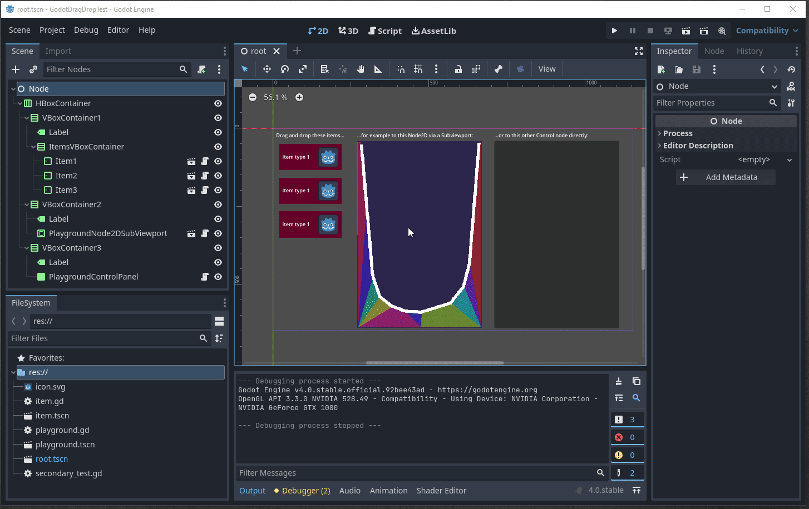

# Sample Godot 4 Drag & Drop between Control and Node2D nodes

This sample demonstrates how you could Drag & Drop items from a `Control` node, to _either_ another `Control` or onto a `Node2D` (via a `SubViewport`).

## Notes

Be warned!
This repository:

- Was created while _learning_ Godot 4, and is _not_ "expert advice";
- Will likely not be kept up to date;
- Might have differences for Godot 3.x and earlier;

Still, it might help someone!

## Demo

This is what it should do:

